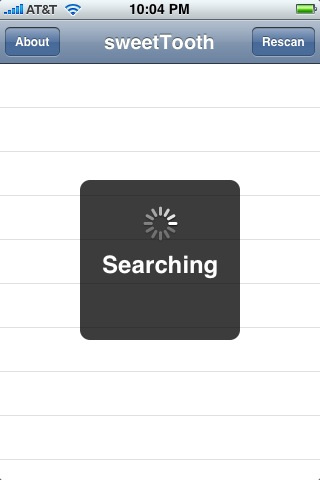

# Bluesn0w - an open implementation of Bluetooth on the iPhone 3G

A few summers ago I decided to create an implementation of the iPhone 3G bluetooth driver that could communicate with other standards compliant bluetooth devices.

The task wasn't the easiest thing I've ever done (especially as a higher level software designer) but coding that close to the bare metal was an exhilarating, primal and really satisfying experience.

 
